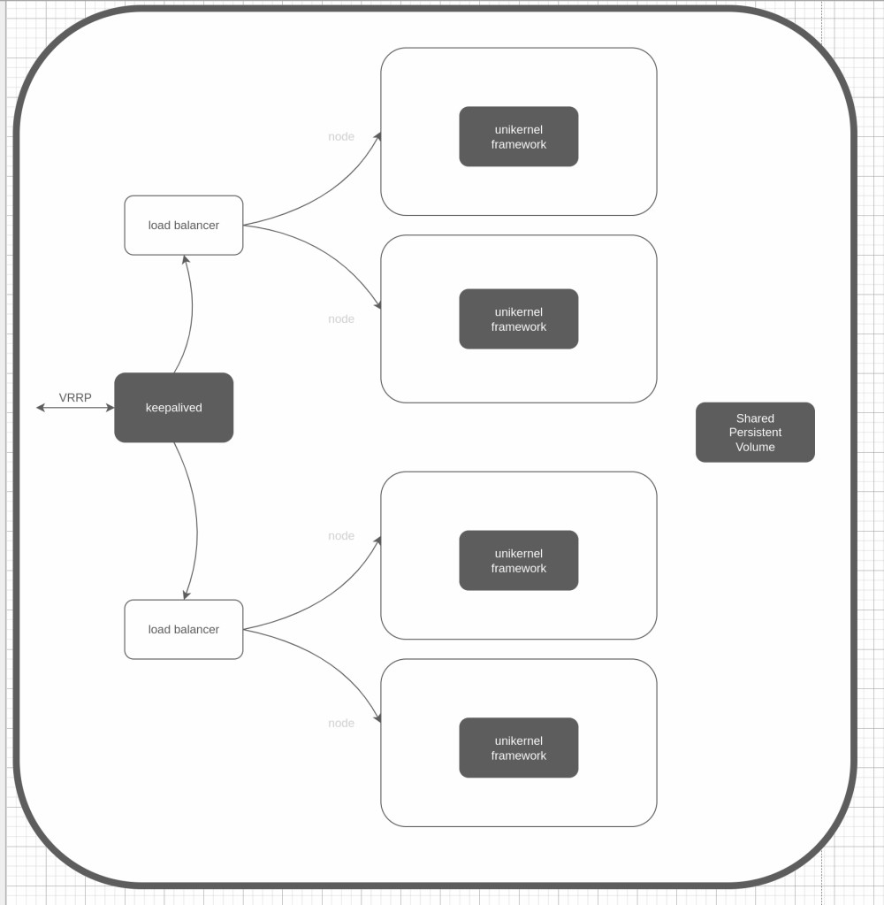

# Overview

## Using ansible to install and deploy

- clone this repo
- cd into unikernel-serverless/ansible

## Architecure overview



## Prerequisites

- All servers have ssh access with ssh keys copied to authorized_keys on each server (ansible requirement)
- Ansible has been installed on your local development system

## Setup

Change the relevant variables in the setup.sh file. It replaces all vars needed by ansible

I initially used these vars in the inventory files but decided to move them. Feel free to change it.

Execute the convenience script.

```
./setup.sh
```

## Install dependencies, build deploy and start unikernels

This assumes you have already built your serverless unikernels locally
using the cli tool https://github.com/lmzuccarelli/rust-serverless-interface-cli

Execute the following playbooks (in the given order)

### Setup local environment

```
# skip if you have rust installed locally
ansible-playbook rust.yml -i inventories/local

ansible-playbook unikernel.yml -i inventories/local 
```

### Setup unikernel ecosystem on each node

```
ansible-playbook unikernel.yml -i inventories/servers
```

### Ensure load balancer servers have keepalived installed

```
ansible-playbook keepalived.yml -i inventories/servers --tags check
```

### Compile and build convey load-balancer unikerenl locally

```
ansible-playbook load-balancers.yml -i inventories/local --tags fetch-build
```

### Copy and create instances on both worker & load-balancer nodes

```
ansible-playbook load-balancers.yml -i inventories/servers --tags deploy
ansible-playbook serverless.yml -i inventories/servers --tags deploy
```

### Verify using the vrrp (virtual router redundancy protocol) ip address (this may vary according to your keepalived.config)

```
curl -d'@files/payload.json' http://192.168.0.100/publish
```

### Pipeline script

I have included a simple pipeline script that includes all the ansible playbooks as indicated above

Execute it using the relevant step

```
./pipeline.sh 1
./pipeline.sh 2
# and so on
```

### Notes

For better performance I found that updating the following files (with suggested values)

This is Fedora/Centos specific

This is by no means an exhaustive list for fine tuning.

```
/etc/security/limits.conf

#<user>     <type>    <item>     <value>
*           soft      nofile     1048576
*           hard      nofile     1048576
root        soft      nofile     1048576
root        hard      nofile     1048576

/etc/sysctl.conf
fs.file-max = 1048576
```
